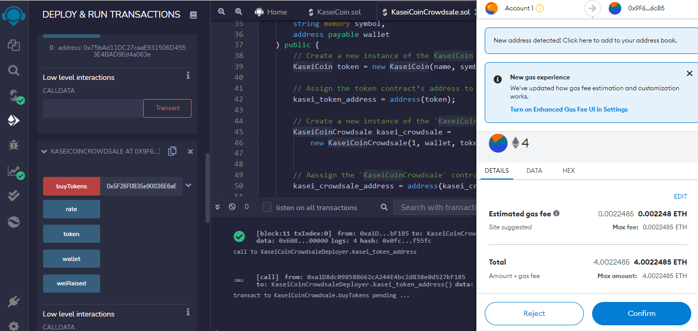

# Creating a New Token

Below are screen shots of the step by step process for creating the new KaceiCoin ERC-20 token

---

## Step 1) Compile the KaceiCoin token contract

## Step 2) Compile the KaceiCoin Crowdsale contact

## Step 3) Deploy KaceiCoin and the KaceiCoin Crowdsale contracts:

## Step 4) Perform a sample purchase of the new token

## Step 5) Check the balance of the account after purchase (in ether and the new KC token)

## Step 6) Check total supply of newly minted token

